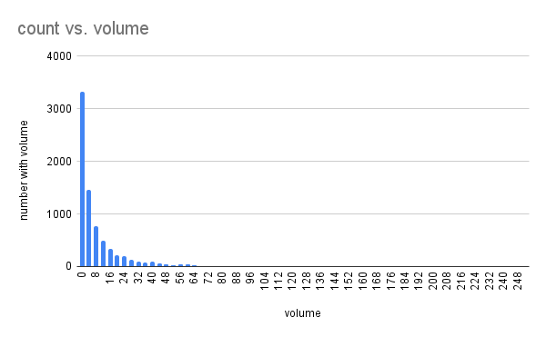

# Project files

## 'number of clusters vs. radius of gyration.png'  

## 'number with surface area vs. surface area.png'

'number with surface area vs. surface area.png'

## 'number of cavities vs. diameter.png'  

'number of cavities vs. diameter.png'  

## 'number of clusters vs. span.png'                

'number of clusters vs. span.png'                

## 'volume with radius vs. radius.png'

'volume with radius vs. radius.png'

