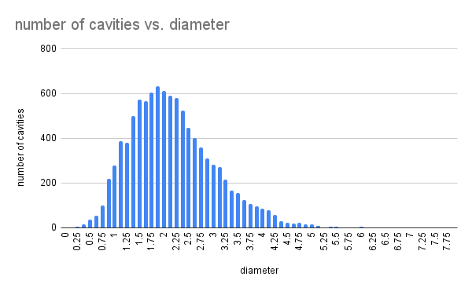
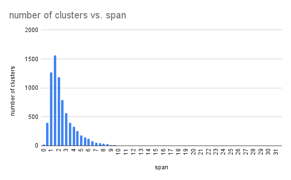
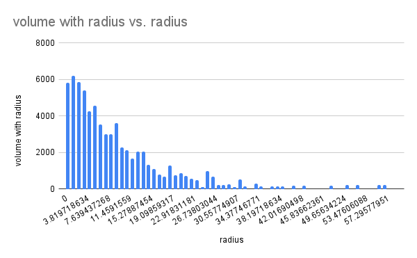
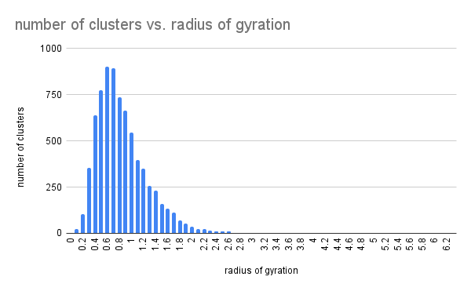
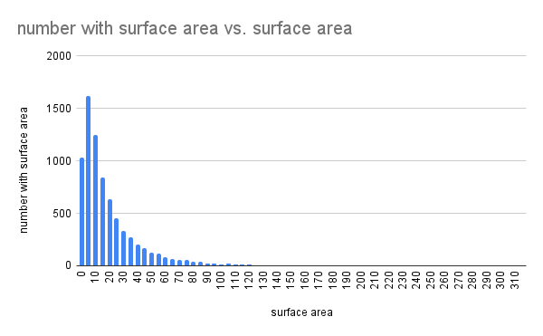

# Project files

## Cavity size distribution, count vs. volume

## Cavity size distribution, count vs. diameter

## Cavity clusters, number of clusters vs. span

## Cavity size distribution, volume vs. radius

## Cavity cluster distribution, number of clusters vs. radius of gyration  

## Cavity clusters, number vs. surface area

